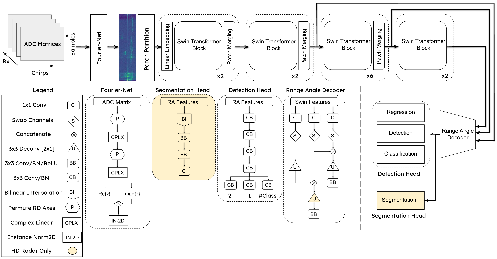
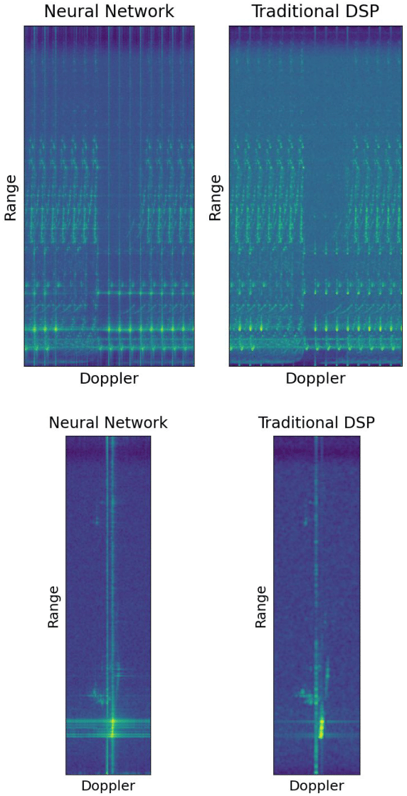

# T-FFTRadNet:  Object Detection with Swin Vision Transformers from Raw ADC Radar Signals
Accepted into the Bravo Workshop at ICCV 2023.

This repository contains all code needed to reproduce experiments and is based on the implementation from [ValeoAI](https://github.com/valeoai/RADIal).

HD Radar (RadIal dataset) and LD Radar (RADDet dataset) models are split into separate folders. Each folder follows a similar structure.

# Abstract 
Object detection utilizing Frequency Modulated Continuous Wave radar is becoming increasingly popular in the field of autonomous systems. Radar does not possess the same drawbacks seen by other emission-based sensors such as LiDAR, primarily the degradation or loss of return signals due to weather conditions such as rain or snow. However, radar does possess traits that make it unsuitable for standard emission-based deep learning representations such as point clouds. Radar point clouds tend to be sparse and therefore information extraction is not efficient. To overcome this, more traditional digital signal processing pipelines were adapted to form inputs residing directly in the frequency domain via Fast Fourier Transforms. Commonly, three transformations were used to form Range-Azimuth-Doppler cubes in which deep learning algorithms could perform object detection. This too has drawbacks, namely the pre-processing costs associated with performing multiple Fourier Transforms and normalization. We explore the possibility of operating on raw radar inputs from analog to digital converters via the utilization of complex transformation layers. Moreover, we introduce hierarchical Swin Vision transformers to the field of radar object detection and show their capability to operate on inputs varying in pre-processing, along with different radar configurations, i.e., relatively low and high numbers of transmitters and receivers, while obtaining on par or better results than the state-of-the-art.
# Contents
- [Requirements](#Section-1)
- [Dataset Access](#Section-2)
- [T-FFTRadNet](#Section-3)
- [Usage](#Section-4)
    

# Requirements

## Model Development

System:     Windows 11  
Python:     3.9.12  
Pytorch:    1.12.1  
CUDA:       11.3  
Conda:      4.12.0  

For package requirements run:

`$ conda create --name <env> --file requirements.txt`

# Dataset Access

We utilize two datasets, [RadIal](https://github.com/valeoai/RADIal) and [RADDet](https://github.com/ZhangAoCanada/RADDet#DatasetLink). Each of these datasets can be downloaded from their linked repositories.

For RADDet, we utilize the raw ADC format and perform all pre-processing in the dataloading pipeline. The downloading of the full RAD cubes is not needed.

For RadIal, we utilize both raw ADC and their pre-processed Range-Doppler matrices provided in the link above. We have provided additional code within the RadIal folder to store raw ADC matrices as numpy arrays possessing the correct numbering scheme with respect to the annotation .csv file.

Modify the data_config.json file with the correct paths to the CalibrationTable.npy and labels.csv files. The raw binary files should be located under the Data_dir field.


```
	'Calibration': 'path/to/CalibrationTable.npy',

	'Method': 'ADC',

	'label_path': '/path/to/labels.csv',

	'Data_Dir': 'path/to/raw_binary',

	'Output_Folder': '/path/to/output_destination'
    
```    
You can then execute the following command within the ADCProcessing folder to generate the raw ADC dataset:

`$ python Make_ADC_Data.py --config /path/to/data_config.json`
 


# T-FFTRadNet 

T-FFTRadNet builds off prior work from [FFTRadNet](https://github.com/valeoai/RADIal/tree/main/FFTRadNet), utilizing heirachical Swin Vision transformers as the feature extraction head on Range-Doppler inputs.



The model is capable of utilizing raw ADC inputs via complex-valued linear layers from [CubeLearn](https://github.com/zhaoymn/cubelearn) that mimic the action of a 2D Fourier Transform. These layers provide the removal of all pre-processing/normalization and provide increased mAP in LD radar settings. In HD radar, performance is approximately the same as standard Fourier Transform. Inference time is greatly reduced via the utilization of raw ADC and the complex-valued layers.



# RADDet Usage

Download the raw ADC files along with the gt_box and gt_box_test files and structure them as follows:
```
└── RADDet_Data/  
    ├── ADC/   
    ├── gt_box/  
    └── gt_box_test/
```

In the Train.py and Evaluation.py folders, two datasets will be created with flags 'Training' and 'Testing'. All testing indices will be subtracted from the training dataset.

We provide three config files, 'RAD_config.json, RD_config.json' and 'ADC_config.json'. The data_mode field will control inputs to the model and model creation. The name field will correspond to the experiment name and will be included in the newly created folder where the model is saved at each epoch during training, the config file used is copied and other log files. Please modify the root_dir field to point to where the RADDet_Data folder is stored, and modify the output directory field to where you want created models to be stored.

A model utilizing ADC inputs can then be trained using the following command:

`$ python Train.py --config config/ADC_config.json`

To evaluate models run the following command:

`$ python Evaluate.py --config /path/to/my_experiment/config.json --checkpoint /path/to/my_experiment/model.pth`

The config files provided include normalization constants for each of the differing input types. To obtain your own normalization constants you can run the following command within the dataset folder:

`$ python print_dataset_statistics.py`

# RadIal Usage

After producing the raw ADC data, downloading the Range-Doppler matrices and other data files structure them as below:
```
└── RadIal_Data/
    ├── ADC_Data/ 
    ├── camera/
    ├── laser_PCL/
    ├── radar_FFT/
    ├── radar_Freespace/
    ├── radar_PCL/
    └── labels.csv
```

Note: It is possible to utilize raw ADC and perform all Fourier Transforms in the dataloading pipeline. However, this is slow and we reccomend creating new files for these inputs and loading them in.

We provide three config files, 'RD_config.json, RD_Shift_config.json' and 'ADC_config.json'. The data_mode field will control inputs to the model and model creation, for example a Range-Doppler matrix with centered zero Doppler frequency. The name field will correspond to the experiment name and will be included in the newly created folder where the model is saved at each epoch during training, the config file used is copied and other log files. Please modify the root_dir field to point to where the RadIal_Data folder is stored, and modify the output directory field to where you want created models to be stored.


A model utilizing ADC inputs can then be trained using the following command:

`$ python 1-Train.py --config config/ADC_config.json`

To evaluate models run the following command:

`$ python 3-Evaluate.py --config /path/to/my_experiment/config.json --difficult --checkpoint /path/to/my_experiment/model.pth`

The --difficult flag includes both 'easy' and 'difficult' scenes for evaluation. Removal of this implies only 'easy' scenes.

The config files provided include normalization constants for each of the differing input types. To obtain your own normalization constants you can run the following command within the dataset folder:

`$ python print_dataset_statistics.py`

Visualization of the model's output can be obtained via the following command:

`$ python 2-Test.py --config /path/to/config.json --difficult --checkpoint /path/to/model.pth`

In each case, training can be resumed via the command:

`$ python Train.py --config /path/to/config.json --resume /path/to/previous_model.pth`

Note: You will need to modify the experiment name in the config file to resume training. We reccomend 'previous_experiment_name_resume'.

# Pre-trained Models

Pre-trained models can be found at the following [link](https://drive.google.com/drive/folders/1xihOyEDL_hHrkTi4rdgJ3LvIJO_z_jIk?usp=sharing). These models can be utilized with the provided config files.
